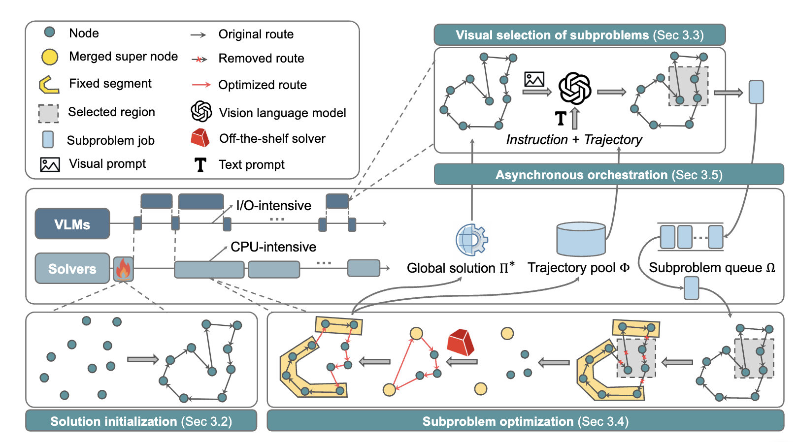

# ViTSP: A Vision Language Models Guided Framework for Solving Large-Scale Traveling Salesman Problems

<div align="center">
  
[](https://iclr.cc/Conferences/2026)
[](LICENSE)
[](#paper)
[](https://openreview.net/forum?id=2LoaiaGKuV&noteId=Amm8FnWJZa)

</div>

This is the repo for ViTSP accepted by **ICLR 2026**.

## 🚀 TL;DR

Learning-based methods have shown promise in combinatorial optimization, but they often fail when problem instances differ in scale or structure from those seen during training. ViTSP is a **hybrid GenAI–OR framework**, transforming routing instances into visual representations and allowing Vision Language Models (VLMs) to propose meaningful subproblem decompositions. These subproblems are asynchronously solved by exact OR solvers, yielding high-quality solutions in practice without task-specific training.

<p align="center">
  
</p>

## ✨ Highlights

- Vision-language guided decomposition heuristics for large routing instances

- Exact OR solvers for local optimality guarantees

- Asynchronous system design for heterogeneous compute pipelines

- Training-free generalization across TSP scales, outperforming learning-based methods

## 
If you find our work useful, please cite:
```
@inproceedings{
yin2026vitsp,
title={Vi{TSP}: A Vision Language Models Guided Framework for Large-Scale Traveling Salesman Problems},
author={Zhuoli Yin and Yi Ding and Reem Khir and Hua Cai},
booktitle={The Fourteenth International Conference on Learning Representations},
year={2026},
url={https://openreview.net/forum?id=2LoaiaGKuV}
}
```

