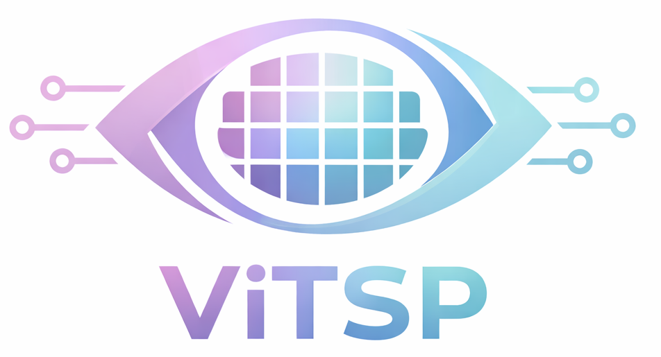

# ViTSP: A Vision Language Models Guided Framework for Large-Scale Traveling Salesman Problems

<p align="center">
  
</p>

<p align="center">

[](https://iclr.cc/Conferences/2026)
[](LICENSE)
[](#paper)
[]([https://openreview.net/forum?id=koIbbsfKSf](https://openreview.net/forum?id=2LoaiaGKuV&noteId=Amm8FnWJZa))

</p>

This is the repo for ViTSP accepted by **ICLR 2026**.


If you find our work useful, please cite:
```
@inproceedings{yin2026vitsp,
  title={ViTSP: A Vision Language Models Guided Framework for Large-Scale Traveling Salesman Problems},
  author={Yin, Zhuoli and Ding, Yi and Khir, Reem and Cai, Hua},
  booktitle={The Fourteenth International Conference on Learning Representations (ICLR)},
  year={2026}
}
```
